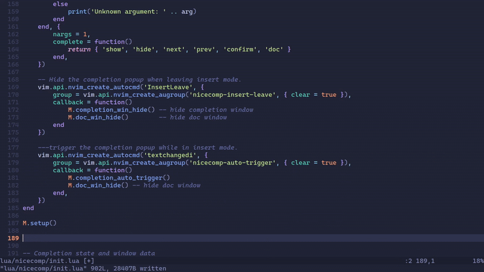

# NiceComp - Totally Serious Completion Plugin

**IT'S SO GOOD THAT YOU WILL REGRET USING IT!**  

Yes, you read that right. This is my **first Neovim plugin** ever, so proceed with caution. Or don't. Your call.

---

## License Agreement

By using this plugin, you agree to:

1. Bow to the code. Seriously, bow. 🙏
2. Never question why things work… or why they don’t.
3. Accept that bugs are actually *features in disguise*.
4. Send money to the author if it breaks. I’m poor 😢

**WARN:** Use at your own risk.

---

## Demo

Check out this totally real demo GIF (not staged):



---

## Installation

Use your favorite plugin manager:

```lua
-- Packer
use 'aydincpp/nice-comp'

-- Lazy.nvim
{ 'aydincpp/nice-comp' }
```
